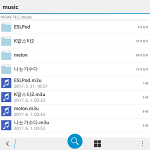

# bb_playlist

## Why Develop?

블랙베리의 기본 음악재생 어플리케이션에는 폴더 기반 재생이 없다.

그래서 별수없이 플레이리스트 기반 재생을 사용할 수 밖에 없는데, 문제는 이 플레이리스트를 만들려면 수십 수백개나 되는 음악파일들을 손으로 하나하나 찾아가며 선택해줘야 한다는 것이다. (폴더기반으로 찾아 들어갈 수가 없어서 전체 음악파일을 이름순으로 보면서 찾아야 한다!)

이런 지루하고 단순한 일이 싫어서, 어차피 폴더재생 안되는거 재생목록만 쉽게 만들어버릴순 없을까 하고 방법을 찾아봤다.

블랙베리에서 사용하는 플레이리스트는 `.m3u` 확장자를 사용하는 텍스트 파일이었는데, 파일 내용을 가만보니깐 단지 음악파일의 절대경로를 CSV 방식으로 기록한 것 뿐이었다. (ex. /accounts/1000/removable/sdcard/music/**MUSIC.mp3**)  

그래서 나는 음악파일을 블랙베리에 넣기전에, 더블클릭 한번만으로 재생목록이 만들어지도록 배치 스크립트를 작성해봤다.


|  |  |
|---------------------|---------------------|
|     playlist.m3u    |    in blackberry    |


깔끔하게 잘 들어갔다!

플레이리스트를 수동으로 만든다는 방식이 그리 좋은 방식은 아니긴한데, 나는 한번 업데이트 한 음악은 왠만해선 잘 안바꾸기 때문에 이런 방식도 나름대로 편리하고 괜찮았다.  
일단은 급한대로 이렇게 쓰다가 나중에 또 흥미가 생기면 더 좋은 방법을 찾아봐야지.


## How To Run
이 배치 스크립트는 윈도우 운영체제의 정리된 음악폴더 안에서 실행되는 것을 가정한다.  
또한 생성된 플레이리스트 파일은 Blackberry OS 10 에서 사용되는 것을 가정한다.

1. 음악폴더에 음악파일을 정리한다
2. 정리된 음악폴더에 `MakerPlaylist.bat` 를 옮긴 뒤, 스크립트를 실행한다.
3. 생성된 플레이리스트 파일과 함께 음악폴더 블랙베리 SD카드의 music/ 에 옮긴다.


## Configuration
기본으로 설정되어있는 경로는 SD 카드의 ~/music/ 디렉토리 이며, 이는 스크립트 상단부분을 수정하는것으로 원하는대로 변경할 수 있다.


## Batch Script
```bat
@echo off
@chcp 65001

:: config
set ROOT=/accounts/1000/removable/sdcard/music
set PLAYLIST_NAME=default
set PLAYLIST_EXT=m3u
set MUSIC_EXT=mp3
set CUR=%cd%

:: delete old playlist
if exist %CUR%\*.%PLAYLIST_EXT% (
  del %CUR%\*.%PLAYLIST_EXT%
)

:: make new playlist
call :makePlaylist
exit

::::::::::::::::::::::::::::
:: function makePlaylist()
::::::::::::::::::::::::::::
:makePlaylist
for %%f in (*.%MUSIC_EXT%) do (
  echo %ROOT%/%%f>>%CUR%\%PLAYLIST_NAME%.%PLAYLIST_EXT%
)
for /D %%d in (*) do (
  cd %%d
  set PLAYLIST_NAME=%%d
  set ROOT=%ROOT%/%%d
  call :makePlaylist
  cd ..
)
exit /b
```
